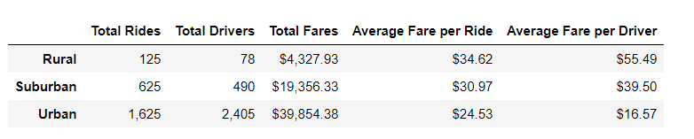
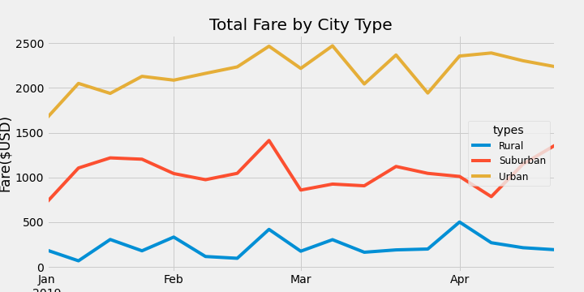

# PyBer Analysis

## Overview of Pyber Analysis
An exploratory analysis on Pyber, a python-based ridesharing app company. This new analysis summarizes Pyber's ridsharing data to show how the data differs by city type and how those differences can be used by decision-makers at PyBer to improve access to Pyber's ridesharing services and determine affordability for underserved neighborhoods. 

## Resources
-Data Source: 
* Resources/city_data.csv  
* Resources/ride_data.csv

-Software: Jupyter Notebook

## Results
The PyBer Summary DataFrame comparsion of Pyber's ridesharing services is shown in three types of cities: rural, surburban, and urban cities. Urban cities shows a larger demand for PyBer compared to suburban and rural cities. There were 1,625 rides in urban cities, 625 rides in suburban cities, and 125 rides in rural cities between January 2019 and May 2019; the most overall rides during this five-month period shows rides in urban cities. 

In terms of costs, the summary shows the average fare for rides in the rural cities is about $11 and $5 more per ride than the urban and surburban cities, the average fare per ride is about $35 in rural cities. The average fare per ride per ride is about $25 in urban cities and about $31 in suburban cities. 

In terms of drivers, the average number of drivers in rural cities is nine to four times less per city than in urban and suburban cities.

whereas the average fare . Suburban cities' average fare per ride falls just in between - at  While it may not be good news for riders in rural cities, it is a better market for drivers in this type of city. The average fare per driver is about $55 in rural cities, whereas the average fare per driver is about $17 in urban cities. Suburban cities' average fare per driver is about $40.

Using images from the summary DataFrame and multiple-line chart, describe the differences in ride-sharing data among the different city types.
Summary: Based on the results, provide three business recommendations to the CEO for addressing any disparities among the city types.
However, , respectively. 
