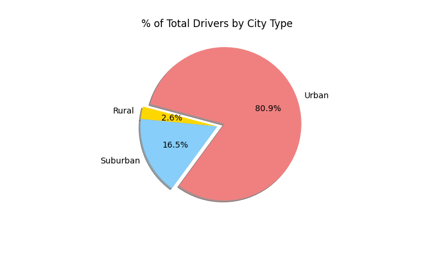

# PyBer Analysis

## Overview of Pyber Analysis
###An exploratory analysis on Pyber, a python-based ridesharing app company. This new analysis seeks to show how the data differs by city type and how those differences can be used by decision-makers at PyBer to improve access to Pyber's ridesharing services and determine affordability for underserved neighborhoods. 

## Resources
-Data Source: 
* Resources/city_data.csv  
* Resources/ride_data.csv

-Software: Jupyter Notebook

## Results
The PyBer Summary DataFrame provides an overview comparison of PyBer's ridesharing services in three types of cities: rural, surburban, and urban cities. The summary demonstrates that there is a larger demand for PyBer among riders in urban cities compared to suburban and rural cities. Between January 2019 and May 2019, there were 1,625 rides in urban cities, 625 rides in suburban cities, and 125 rides in rural cities. The figure below highlights how rides in Urban cities contributed the most to PyBer's overall rides during this five-month period.

Using images from the summary DataFrame and multiple-line chart, describe the differences in ride-sharing data among the different city types.
Summary: Based on the results, provide three business recommendations to the CEO for addressing any disparities among the city types.
